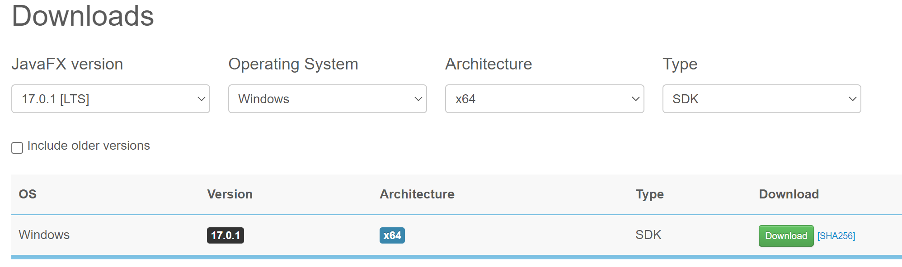
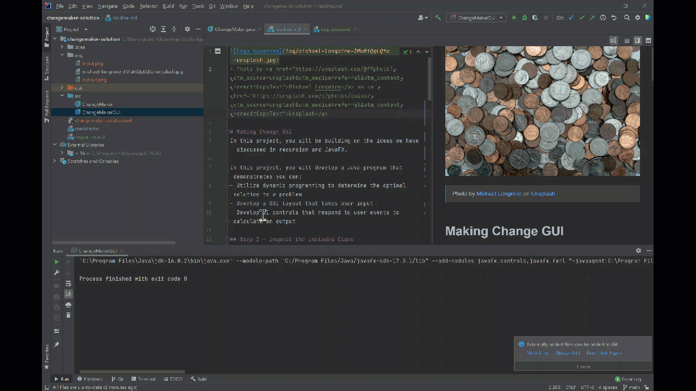
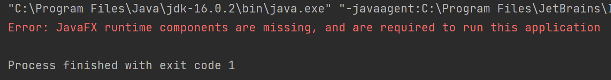
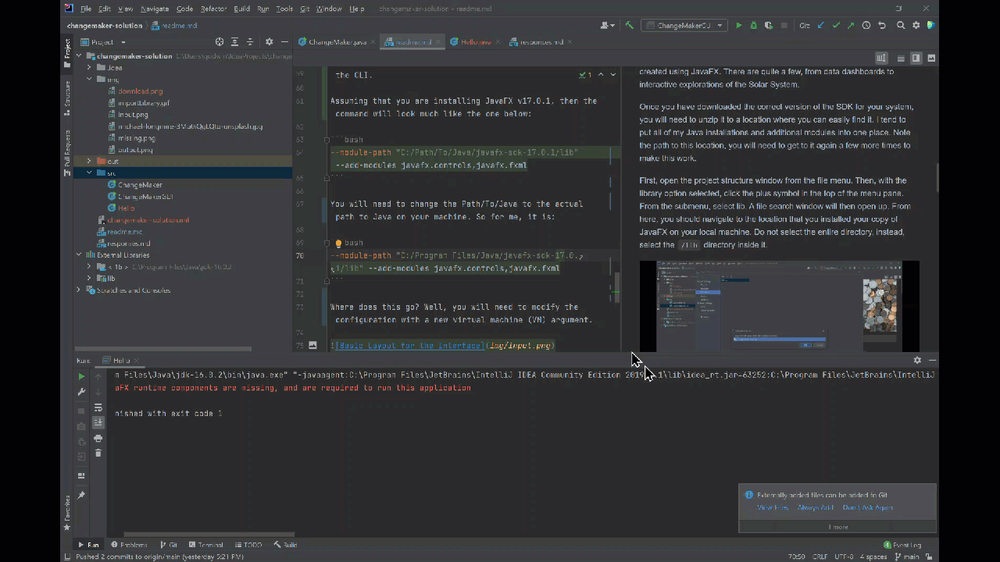
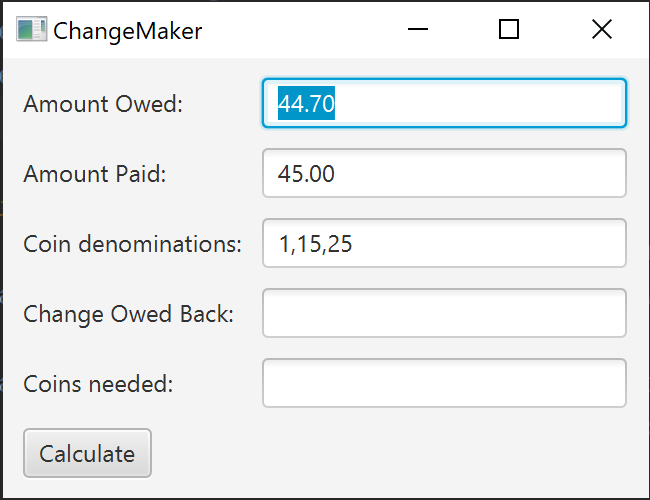
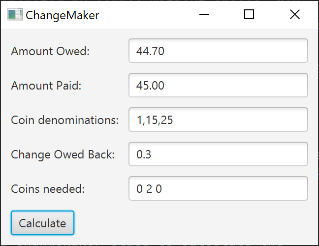

# Change-Maker

> Photo by <a href="https://unsplash.com/@f7photo?utm_source=unsplash&utm_medium=referral&utm_content=creditCopyText">Michael Longmire</a> on <a href="https://unsplash.com/s/photos/coins?utm_source=unsplash&utm_medium=referral&utm_content=creditCopyText">Unsplash</a>

# Making Change GUI
In this project, you will be building on the ideas we have discussed in recursion and JavaFX. 

In this project, you will develop a Java program that demonstrates you can:
- Utilize dynamic programming to determine the optimal solution to a problem
- Develop a GUI layout that takes user input
- Develop UI controls that respond to user events to calculate an output

## Step 1 - Inspect the Included Class
The included file, `ChangeMaker.java`, contains several static methods. Each follows a similar pattern, but they all work a bit differently. Uncomment the correct code to run each one of them. Test them out a bit, and see what makes each of them unique. 

Then, for each algorithm, pick inputs for amount owed, coin denominations, and amount paid other than what is provided in the class currently. In the responses.md file, tell us what these input values were. Then, for each algorithm, copy and paste the output solution and method call count into the responses.md file. Think of this like an experiment - for the same input parameters, what are the outputs of each of them?

**Deliverable 1:**
- Tell us the input you chose for your experiment and the output (you can copy the last line of output showing the solution and count for each of them). 
- In your own words, describe what each of the four approaches to solving the change making problem are doing in 2-3 sentences for each algorithm.

## Step 2 - Create a GUI Layout for Making Change
Before beginning work on your GUI Layout, you will need to first obtain JavaFX and put it on your computer. It can be obtained from [https://openjfx.io/](https://openjfx.io/) (choose the download link). The dropdown menus should allow you to select the exact version that you'll need for your operating system and system architecture. 



While you're there, go ahead and look around at the example projects created using JavaFX. There are quite a few, from data dashboards to interactive explorations of the Solar System. 

Once you have downloaded the correct version of the SDK for your system, you will need to unzip it to a location where you can easily find it. I tend to put all of my Java installations and additional modules into one place. Note the path to this location, you will need to get to it again a few more times to make this work. 

First, open the project structure window from the file menu. Then, with the library option selected, click the plus symbol in the top of the menu pane. From the submenu, select lib. A file search window will then open up. From here, you should navigate to the location that you installed your copy of JavaFX on your local machine. Do not select the entire directory, instead, select the `/lib` directory inside it. 



In your src folder, you will need to create a new `JavaFX` class called `ChangeMakerGUI`. You can do this using the right-click menu on the directory name (`New > JavaFX Application`). If that menu option does not appear, you may not have the JavaFX plug in installed correctly in IntelliJ IDEA. For instructions on how to install it, refer to [https://www.jetbrains.com/help/idea/javafx.html#check-plugin](https://www.jetbrains.com/help/idea/javafx.html#check-plugin). If that still does not work, then you can always create a basic Java class and just add the correct code to make it a JavaFX code. They are really the same thing - here is the starter code for a basic JavaFX application:

```java
import javafx.application.Application;
import javafx.stage.Stage;

public class ChangeMakerGUI extends Application {

    public static void main(String[] args) {
        launch(args);
    }

    @Override
    public void start(Stage primaryStage) {

    }
}
```

With any luck, the import statements should recognize the library that you imported into the project structure and should not be in red. If they are, we may have other problems that need to be resolved. 

Something curious will happen when you try to run the code. While we have taken the steps to ensure that JavaFX is available at compile time, we also need those components to be available at runtime. At this point, if you were to try to run the main method of your `ChangeMakerGUI` class, you would likely be greeted with the following:



We are going to need to add the correct runtime virtual machine arguments. If we were running this from the command line, this would be quite a pain - we would need these arguments every time we compiled the .java file or tried to run the .class files. Instead, using IntelliJ, we can add these arguments to the run configuration so that we do not have to constantly type them. We do have to add them to _every_ class we create, so that is a bit tedious, but not nearly as bad as typing it in through the CLI.

Assuming that you are installing JavaFX v17.0.1, then the command will look much like the one below:

```bash
--module-path "C:/Path/To/Java/javafx-sdk-17.0.1/lib" --add-modules javafx.controls,javafx.fxml
```

You will need to change the Path/To/Java to the actual path to Java on your machine. So for me, it is:

```bash
--module-path "C:/Program Files/Java/javafx-sdk-17.0.1/lib" --add-modules javafx.controls,javafx.fxml
```

Where does this go? Well, you will need to modify the configuration with a new virtual machine (VM) argument. If you have tried to run the `ChangeMakerGUI` file, the configuration for it should be visible in the top menu dropdown between the build tool and the run tool. From that menu, select `edit configurations`. In the window that pops up, select the `Modify options` link in blue. Then, from the dropdown menu, select `Add VM Options`. Then, paste in the argument from the example above. 



Feel free to test it out. At this stage, running will not really do much - you just have an empty JavaFX application without a scene or stage. For this assignment, you will be creating a relatively simple GUI that will open when this application is run. 

It consists of five `Label` objects, five `TextField` objects, and a button. You should aim to recreate the spacing to get it as close to the image below as possible. Feel free to take an example from the textbook and build from it. There are a few different methods to achieve the layout, but most likely, the simplest will be the `GridPane`. 



**Deliverable 2:** A static application that recreates the layout and text for the fields above. 

## Step 3 - Respond to User Input

To complete this step, you must write code so that when a user presses the button the correct coins are counted out and displayed in the GUI.



Again, there are some excellent examples in the textbook for responding to a button click event. Some things to notice about the expected implementation: 

- The amount owed and the amount paid use decimals and can be entered by the user.
- The coin denominations should also be entered by the user. Each number is the value of that coin in cents. Each coin is separated by commas without spaces. You could allow spaces, but this is more work to account for and is not recommended.
- The change owed back is shown as a double, and does not appear until the user presses the `calculate` button. This is the difference between the amount paid and the amount owed in cents. 
- The coins needed is a space-separated list of integers representing the count of the coins needed to make that change. 

Use the provided ChangeMaker class to calculate the optimal number of coins. You do not really need to do any calculation yourself, but you do need to get the text from the fields in the GUI that the user has entered and prepare them as parameters to the correct method in the ChangeMaker class. You might encounter a few small hiccups in switching between integers and doubles, but I think you will have no trouble solving these.

> Note: While you are testing, it is incredibly tedious to have to type the parameters in EVERY time you run. Instead, provide reasonable test values into the textField as the default starting values using `setText`. Your code will parse this text just as it would code entered by the user. When you are done testing, though, you should remove it. 

**Deliverable 3:** Your GUI takes the input parameters from the user, uses those parameters as inputs to an algorithm in the ChangeMaker class, then shows the results in the non-editable text fields in the GUI.

## Extra Credit

There are a lot of opportunities for a user to input the incorrect type of data into the fields above. To make sure that does not happen, you should check the inputs before you try to calculate the output using the algorithm. If the user inputs something incorrectly, your GUI should display an `alert` with information about what went wrong. Again, there is a great example for doing this in the book, but you may also need to incorporate `try/catch` blocks in some places to be certain.


**Deliverable EX:** Your event handling code checks the input from the three editable text fields and displays a descriptive alert if the user enters something incorrectly. Some of these may involve some creativity on your part, as users can be incredibly creative in finding ways to break your program.
